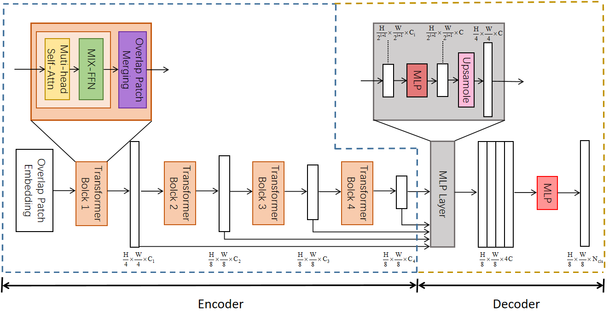
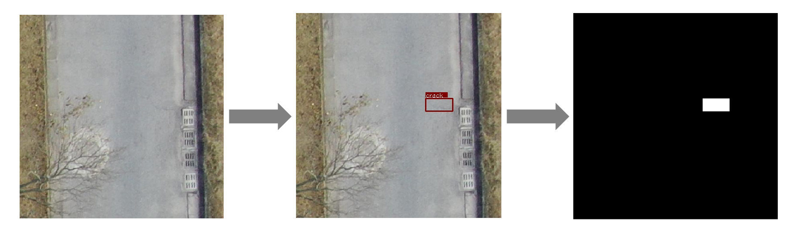

# Segformer_for_road_disease道路病害检测模型

## 1.项目介绍

本项目基于[Segformer](https://arxiv.org/abs/2304.02643)开发，相较于SAM，Segformer在分割任务上有以下优点

- 分层的金字塔式Transformer编码器，可以输出图像多尺度特征。
- 由卷积替代位置编码器，高效保留了图像嵌入序列的位置信息。
- 简单高效的解码器架构，兼顾了计算精度与效率。

模型采用​​分层式Transformer编码器​​，通过多个可以输出不同分辨率特征的Transformer层组成的金字塔结构，在1/4至1/32四个尺度上提取多级特征，兼顾局部细节与全局上下文建模。摒弃了固定式绝对位置嵌入，使用带有重叠区域的卷积将图像分割为小块，并通过卷积操作生成嵌入，更高效地保留了各小块间的空间位置信息，提高了精度与计算效率。解码器采用了简单高效的全连接神经网络架构，将特征图经过双线性插值统一分辨率并执行线性加和融合后，使用MLP层实现像素级分类。Segformer的模型架构如下图所示



模型应用应用了预热微调和学习率余弦衰减策略，以帮助模型在训练中下降的损失稳定并加速收敛。
我们通过以mit-b2和mit-b5两个不同参数量的预训练权重来初始化了两个版本模型的主干网络参数，这两个模型我们命名为Segformer_for_road_disease_b2和Segformer_for_road_disease_b5，b2型版本的模型参数量较小但分割和检测的精度较低，b5型版本的模型参数量较大但分割和检测的精度较高，下表展示了两个模型在CrackTree数据集上的表现

| Model | mean_dice | mean_HD95 | mean_IOU | mAP@0.5 | mAP@0.5:0.95 |
|-|-|-|-|-|-|
| Segformer_for_road_disease_b2 | 0.650 | 21.49 | 0.511 | 0.097 | 0.067 |
| Segformer_for_road_disease_b5 | **0.692** | **10.814** | **0.658** | **0.322** | **0.271** |

## 2.使用说明
本项目的开发平台信息如下：
- CentOS 7.9
- Nvidia Tesla T4 16GB
### 2.1 环境配置
在终端中输入以下指令进行环境配置
```bash
conda create -n Segformer_for_RD python==3.8
```
进入到项目根目录下输入以下指令进行依赖安装
```bash
cd Segformer_for_road_disease
pip install -r requirements.txt
```
### 2.2 数据准备
- 模型输入的照片格式要求为`.jpg`格式，掩码标签格式要求为`.png`格式，照片和标签要分别放置于两个文件夹内。训练和测试需要的目标文件名称请放置于`train.txt`和`val.txt`文件中，训练和测试时模型会从txt中索引目标文件进行训练和测试。
- 图像数据为RGB三通道格式，标签数据为单通道的灰度图，背景像素定义为0，目标像素值依类别定义为标签数字值。
- 图像大小尺寸无要求。
- 我们提供了代码帮助制作训练和测试所需的数据集，内容请参考`./preprocess/preprocess_data.py`。

### 2.3 训练
将准备好的训练数据集和索引.txt文件放于项目根目录下，预训练模型权重要放置于目录`./checkpoints`下。输入下面的命令进行训练

```bash
python train.py --warmup --AdamW --root_path <Your training data path> --list_dir <Your list for training indexes> --output <Your output path> 
```

### 2.4 测试
模型测试支持单张测试、批次测试和视频测试。将训练好的模型文件放置于模型储存目录`./checkpoints`下，在终端中输入以下指令进行单张测试
```bash
python test.py --is_savenii --volume_path <Your test dataset path> --output_dir <Your test output directory> --lora_ckpt <path where your LoRA model checkpoints are>
```
输入下面指令进行批次测试
```bash
python test.py --is_savenii --volume_path <Your test dataset path> --output_dir <Your test output directory> --lora_ckpt <path where your LoRA model checkpoints are> --module sam_lora_image_encoder_mask_decoder
```
输入下面指令进行视频测试
```bash
```

## 3.分割模型在目标检测任务上的尝试
为了探索分割模型在目标检测任务上拓展应用的可能性，我们还使用目标检测数据集RDD2022_CN对Segformer_for_road_disease模型进行了训练和测试。RDD2022_CN数据集的是方框（bounding box）标注而非精确的像素级掩码(mask)标注，这样的标注不符合SAM分割模型的训练输入格式，因此我们依照目标检测的方框标记制作了掩码标注图像，在掩码标注图像中，目标方框内的所有像素值被定义为类别标签值（如裂缝被定义为标签1，孔洞被定义为标签2）

虽然将掩码标注图像中目标方框内的所有像素值被定义为类别标签值的方法轻易地实现了分割模型向目标检测任务上的拓展，但是模型在该数据集上的表现并不优异。这是由于该标注方法实际上属于粗略的像素级标注，其会在训练过程中给模型引入病害周围环境的噪声，导致模型学习到了大量与病害无关的特征，从而导致模型的训练损失一直居高不下极难收敛。对此我们在模型的训练过程中采用了热身和学习率指数衰减策略，即在模型训练初始的一段时间给予其较低的学习率，随着训练的进行，学习率达到一个最大值，而后开始余弦衰减，帮助模型的训练损失收敛。下表展示的是两个模型在RDD2022_CN路面病害数据集上的表现

- Segformer_for_road_disease_b2版本：
  
| Disease category | mean_dice | mean_HD95 | mean_IOU | mAP@0.5 | mAP@0.5:0.95 |
|-|-|-|-|-|-|
| Crack | 0.334 | 106.849 | 0.215 | 0.117 | 0.054 |
| Pothole | 0.164 | **21.487** | 0.145 | 0.161 | 0.054 |
| Patch | **0.339** | 89.170 | **0.313** | **0.289** | **0.154** |
|Average | 0.334 | 99.082 | 0.229 | 0.151 | 0.072 |

- Segformer_for_road_disease_b5版本：
  
| Disease category | mean_dice | mean_HD95 | mean_IOU | mAP@0.5 | mAP@0.5:0.95 |
|-|-|-|-|-|-|
| Crack | 0.576 | 84.670 | 0.429 | 0.416 | 0.205 |
| Pothole | 0.327 | **23.465** | 0.296 | 0.429 | 0.193 |
| Patch | **0.618** | 64.519 | **0.605** | **0.673** | **0.447** |
| Average | 0.576 | 79.361 | 0.456 | 0.462 | 0.247|

### 4.作者

[Ica_l](desprado233@163.com)
参考项目来源：
```
@article{kirillov2023segany,
  title={[Segment Anything](https://arxiv.org/abs/2304.02643)},
  author={Kirillov, Alexander and Mintun, Eric and Ravi, Nikhila and Mao, Hanzi and Rolland, Chloe and Gustafson, Laura and Xiao, Tete and Whitehead, Spencer and Berg, Alexander C. and Lo, Wan-Yen and Doll{\'a}r, Piotr and Girshick, Ross},
  journal={arXiv:2304.02643},
  year={2023}
}
```
```
@article{samed,
  title={[Customized Segment Anything Model for Medical Image Segmentation](https://arxiv.org/abs/2304.13785)},
  author={Kaidong Zhang, and Dong Liu},
  journal={arXiv preprint arXiv:2304.13785},
  year={2023}
}
```

## SegFormer语义分割模型在Pytorch当中的实现
---

### 目录
1. [仓库更新 Top News](#仓库更新)
2. [相关仓库 Related code](#相关仓库)
3. [性能情况 Performance](#性能情况)
4. [所需环境 Environment](#所需环境)
5. [文件下载 Download](#文件下载)
6. [训练步骤 How2train](#训练步骤)
7. [预测步骤 How2predict](#预测步骤)
8. [评估步骤 miou](#评估步骤)
9. [参考资料 Reference](#Reference)

## Top News
**`2022-06`**:**创建仓库、支持训练时评估、支持多backbone、支持step、cos学习率下降法、支持adam、sgd优化器选择、支持学习率根据batch_size自适应调整。**  

## 相关仓库
| 模型 | 路径 |
| :----- | :----- |
Unet | https://github.com/bubbliiiing/unet-pytorch  
PSPnet | https://github.com/bubbliiiing/pspnet-pytorch
deeplabv3+ | https://github.com/bubbliiiing/deeplabv3-plus-pytorch
hrnet | https://github.com/bubbliiiing/hrnet-pytorch
segformer | https://github.com/bubbliiiing/segformer-pytorch

### 性能情况
| 训练数据集 | 权值文件名称 | 测试数据集 | 输入图片大小 | mIOU | 
| :-----: | :-----: | :------: | :------: | :------: | 
| VOC12+SBD | [segformer_b0_weights_voc.pth](https://github.com/bubbliiiing/segformer-pytorch/releases/download/v1.0/segformer_b0_weights_voc.pth) | VOC-Val12 | 512x512 | 73.34 | 
| VOC12+SBD | [segformer_b1_weights_voc.pth](https://github.com/bubbliiiing/segformer-pytorch/releases/download/v1.0/segformer_b1_weights_voc.pth) | VOC-Val12 | 512x512 | 76.80 | 
| VOC12+SBD | [segformer_b2_weights_voc.pth](https://github.com/bubbliiiing/segformer-pytorch/releases/download/v1.0/segformer_b2_weights_voc.pth) | VOC-Val12 | 512x512 | 80.38 | 

### 所需环境
torch==1.2.0  

### 文件下载
训练所需的权值可在百度网盘中下载。     
链接: https://pan.baidu.com/s/1tH4wdGnACtIuGOoXb0_rAw    
提取码: tyjr      

VOC拓展数据集的百度网盘如下：   
链接: https://pan.baidu.com/s/1vkk3lMheUm6IjTXznlg7Ng    
提取码: 44mk    

### 训练步骤
#### a、训练voc数据集
1、将我提供的voc数据集放入VOCdevkit中（无需运行voc_annotation.py）。  
2、在train.py中设置对应参数，默认参数已经对应voc数据集所需要的参数了，所以只要修改backbone和model_path即可。  
3、运行train.py进行训练。  

#### b、训练自己的数据集
1、本文使用VOC格式进行训练。  
2、训练前将标签文件放在VOCdevkit文件夹下的VOC2007文件夹下的SegmentationClass中。    
3、训练前将图片文件放在VOCdevkit文件夹下的VOC2007文件夹下的JPEGImages中。    
4、在训练前利用voc_annotation.py文件生成对应的txt。    
5、在train.py文件夹下面，选择自己要使用的主干模型。
6、注意修改train.py的num_classes为分类个数+1。    
7、运行train.py即可开始训练。  

### 预测步骤
#### a、使用预训练权重
1、下载完库后解压，在百度网盘下载权值，放入model_data，修改segformer.py的backbone和model_path之后再运行predict.py，输入。  
```python
img/street.jpg
```
可完成预测。    
2、在predict.py里面进行设置可以进行fps测试、整个文件夹的测试和video视频检测。       

#### b、使用自己训练的权重
1、按照训练步骤训练。    
2、在segformer.py文件里面，在如下部分修改model_path、num_classes、backbone使其对应训练好的文件；**model_path对应logs文件夹下面的权值文件，num_classes代表要预测的类的数量加1，backbone是所使用的主干特征提取网络**。    
```python
_defaults = {
    #-------------------------------------------------------------------#
    #   model_path指向logs文件夹下的权值文件
    #   训练好后logs文件夹下存在多个权值文件，选择验证集损失较低的即可。
    #   验证集损失较低不代表miou较高，仅代表该权值在验证集上泛化性能较好。
    #-------------------------------------------------------------------#
    "model_path"        : "model_data/segformer_b0_weights_voc.pth",
    #----------------------------------------#
    #   所需要区分的类的个数+1
    #----------------------------------------#
    "num_classes"       : 21,
    #----------------------------------------#
    #   所使用的的主干网络：
    #   b0、b1、b2、b3、b4、b5
    #----------------------------------------#
    "phi"               : "b0",
    #----------------------------------------#
    #   输入图片的大小
    #----------------------------------------#
    "input_shape"       : [512, 512],
    #-------------------------------------------------#
    #   mix_type参数用于控制检测结果的可视化方式
    #
    #   mix_type = 0的时候代表原图与生成的图进行混合
    #   mix_type = 1的时候代表仅保留生成的图
    #   mix_type = 2的时候代表仅扣去背景，仅保留原图中的目标
    #-------------------------------------------------#
    "mix_type"          : 0,
    #-------------------------------#
    #   是否使用Cuda
    #   没有GPU可以设置成False
    #-------------------------------#
    "cuda"              : True,
}
```
3、运行predict.py，输入    
```python
img/street.jpg
```
可完成预测。    
4、在predict.py里面进行设置可以进行fps测试、整个文件夹的测试和video视频检测。   

### 评估步骤
1、设置get_miou.py里面的num_classes为预测的类的数量加1。  
2、设置get_miou.py里面的name_classes为需要去区分的类别。  
3、运行get_miou.py即可获得miou大小。  

### Reference
https://github.com/ggyyzm/pytorch_segmentation  
https://github.com/bonlime/keras-deeplab-v3-plus
https://github.com/NVlabs/SegFormer